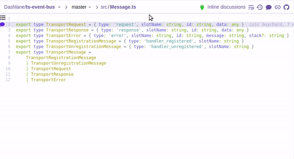

# Sourcegraph String References Extension

A [Sourcegraph](https://sourcegraph.com) extension allowing to find references to a string literal using the Sourcegraph code search.

# TODO

- This currently only works on the current repository. It should work without a repository filter when using a private Sourcegraph instance
